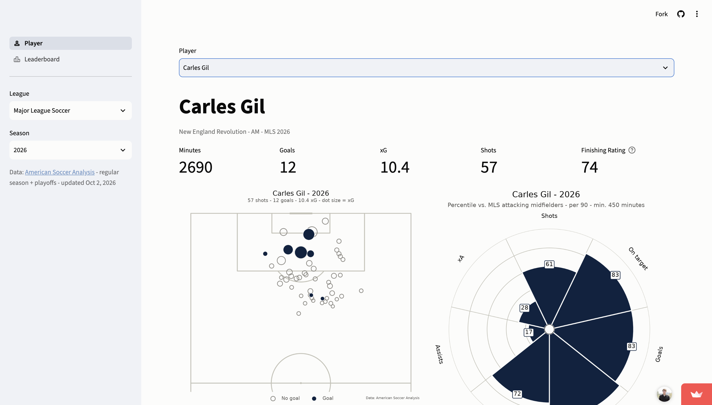
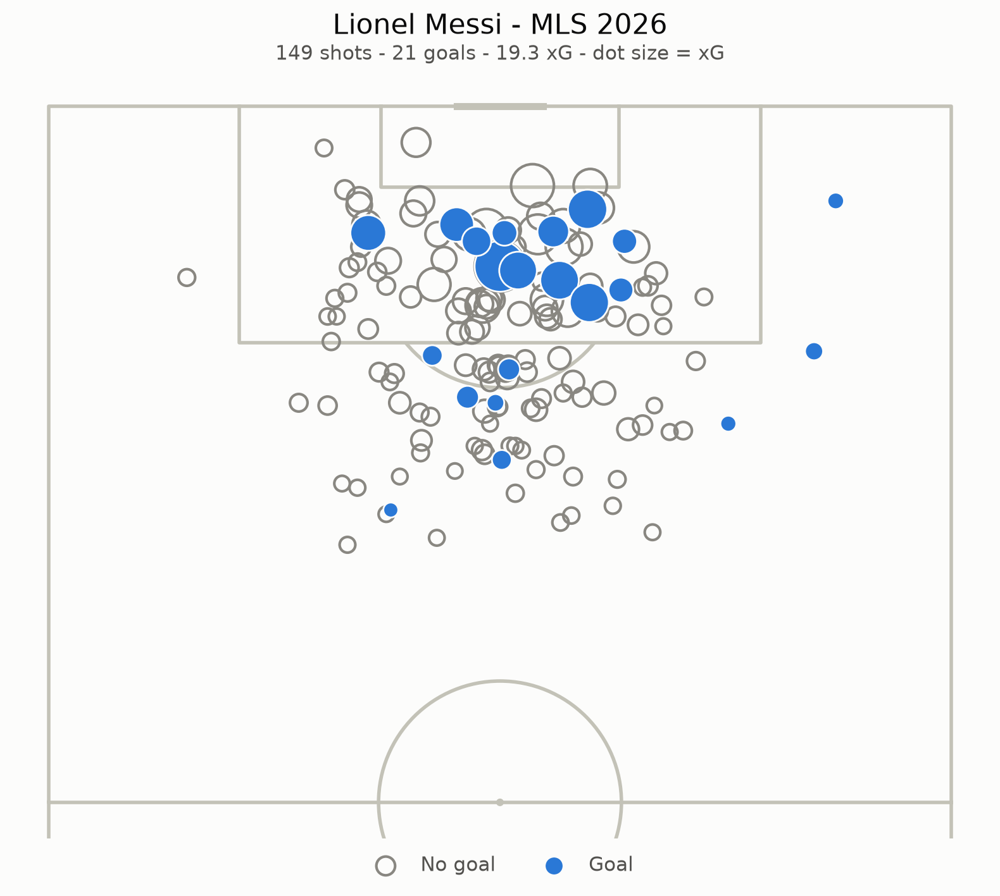
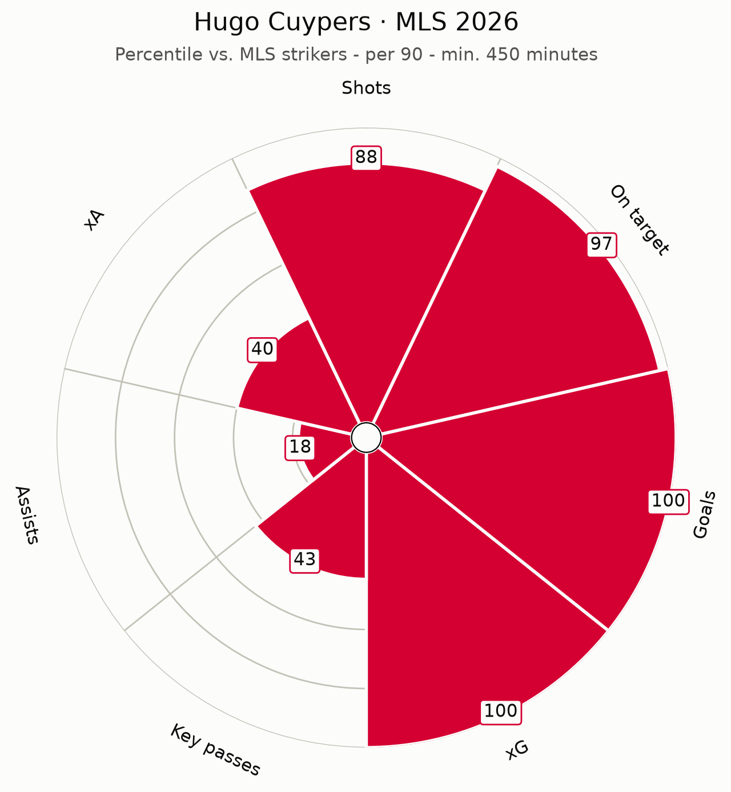
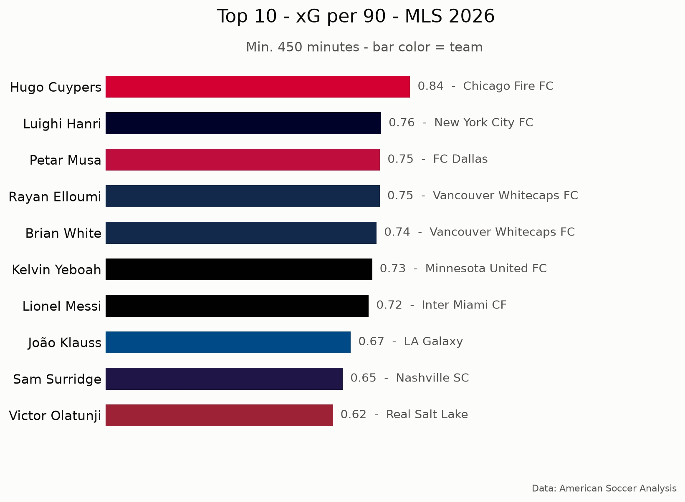

# Hughes Soccer Analytics Engine

Player analytics for American pro soccer: **MLS, NWSL, USL Championship, USL League One and USL Super League**. It has shot maps, percentile profiles, leaderboards and a custom **Finishing Rating**, built with Python and Streamlit.

**[Open the live app →](https://hughes-soccer-analytics.streamlit.app)**
<p align="center">
  
</p>

<p align="center">
  
  
</p>
<p align="center">
  
</p>

## What's in the app

Pick a league and season in the sidebar. Each league has its three most recent seasons.

**Player page**
- Search any player with 450+ minutes for a team in that season.
- See season totals for minutes, goals, xG and shots, plus the Finishing Rating (latest season only).
- The shot map shows every shot. Goals are filled in the team's color, misses are gray rings, and dot size shows xG.
- The percentile pizza covers 7 per-90 stats, compared with players at the same position.

**Leaderboard**
- Shows the top 5–25 players for the Finishing Rating or any of the 7 per-90 stats.
- Bars use team colors, with a table underneath.

## The Finishing Rating

Goals minus xG (expected goals) is the usual way to measure finishing, but it's noisy: a player with 20 shots can beat their xG by luck alone. The Finishing Rating (0–100) accounts for that.

1. **Combine** a player's rows for the season, so a traded player counts once.
2. **Qualify:** the player needs 450+ minutes and 20+ shots.
3. **Shrink toward average:** goals above xG per shot is pulled toward the league average:

   `shrunk finishing = (goals − xG + k × league average) / (shots + k)`, with **k = 300**

   This is like adding 300 league-average shots to every player's record. A player needs a big sample before their finishing moves far from average.
4. **Season score** = 0.7 × percentile of shrunk finishing + 0.3 × percentile of shots per 90. These percentiles compare across all positions.
5. **Final rating** = 0.7 × this season + 0.2 × last season + 0.1 × two seasons ago. A missing season counts as this season's score.

Examples from MLS 2026:

| Player | Shots | Goals | xG | Finishing Rating |
|---|---|---|---|---|
| Lionel Messi | 149 | 21 | 19.3 | 93 |
| Hugo Cuypers | 40 | 13 | 10.5 | 72 |
| Rafael Navarro | 80 | 15 | 18.4 | 31 |

Cuypers beat his xG by more than Messi did, but on far fewer shots, so the rating trusts it less.

## Choosing k: a backtest

k decides how much to trust a player's own record. I tested candidate values by using each player's finishing in one season to predict their finishing in the next. The test covered every pair of consecutive seasons in all five leagues: 10 season pairs and 1,481 player-season pairs, weighted by shots. The code is in [`scripts/tune_k.py`](scripts/tune_k.py).

| Prediction | Error compared with "everyone is average" |
|---|---|
| k = 40 | 8.5% worse |
| k = 250 | 1.34% better |
| k = 275 (best) | 1.35% better |
| **k = 300 (chosen)** | **1.34% better** |
| k = 350 | 1.31% better |

- The error is almost flat from 250 to 350. 275 was best by only 0.005%, so I used the rounder 300 rather than claim false precision.
- A small k, which trusts each player's own record, does worse than assuming everyone is average.
- Even the best k is only about 1.3% better than "everyone is average." **Most of a player's goals above xG in one season is noise.** Finishing barely carries over from one season to the next.

## Data

- **Source:** [American Soccer Analysis](https://www.americansocceranalysis.com). Player stats come through the [itscalledsoccer](https://github.com/American-Soccer-Analysis/itscalledsoccer) package, and shots come from the ASA API.
- **Coverage:** regular season and playoffs combined. Last updated Oct 2, 2026.
- **Not covered:** Leagues Cup, U.S. Open Cup and CONCACAF competitions.

## Limitations

- Totals can differ from other sites, because of which competitions are covered and how goals are credited.
- The 450-minute minimum applies per team, so a traded player can appear once for each team in per-90 leaderboards.
- The Finishing Rating is only shown for the latest season, and new seasons have small samples. For example, USL Super League 2026 has just 3 rated players.
- Percentiles compare players within their position (GK, CB, FB, DM, CM, AM, W, ST).
- The stats are shot-based, so they say little about defenders and deep-lying midfielders.
- Some USL clubs don't have team colors yet and use a default blue.
- The data is refreshed by hand.

## Run it locally

You'll need Python 3.13.

```bash
git clone https://github.com/gavinhughes11/Hughes-Soccer-Analytics-Engine.git
cd Hughes-Soccer-Analytics-Engine
python3.13 -m venv .venv
source .venv/bin/activate
pip install -r requirements.txt
streamlit run streamlit_app.py
```

Run other commands from the repo root with `python -m`:

```bash
python -m scripts.refresh_data      # re-download all data (takes a few minutes)
pip install -r requirements-dev.txt
python -m pytest                    # run the tests
```

## Project structure

```text
streamlit_app.py   App entry point: sidebar and page navigation
app/               Player and Leaderboard pages, cached data loaders
charts/            Shot map, pizza and leaderboard charts, team colors, data credit
metrics/           Per-90 stats, percentiles, Finishing Rating
data_sources/      American Soccer Analysis data access
scripts/           Data refresh, k backtest, team color builder
data/              Saved data (parquet files) and team colors
tests/             pytest tests
config.py          Settings: leagues, seasons, minimums, weights, colors
```

## What's next

- An "include playoffs" toggle
- A weekly automatic data refresh
- Chart downloads sized for social media
- Goals added (g+), so defenders and midfielders get useful profiles
- A USL-to-MLS prospect finder

## Built with

Python 3.13 · pandas · Streamlit · matplotlib · mplsoccer · itscalledsoccer

Data from [American Soccer Analysis](https://www.americansocceranalysis.com). Team colors from [TruColor](https://www.trucolor.net). The project layout was inspired by [Bradley Analytics Software Engine](https://github.com/alexbrxdley/Bradley-Analytics-Software-Engine).

Built by [Gavin Hughes](https://github.com/gavinhughes11).
